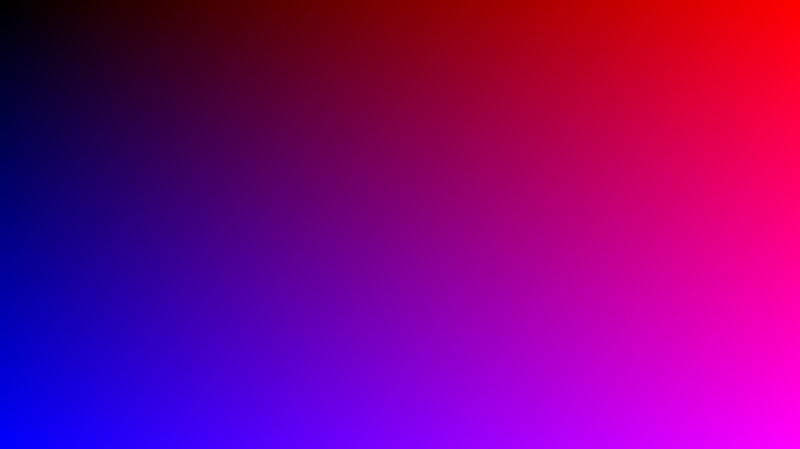
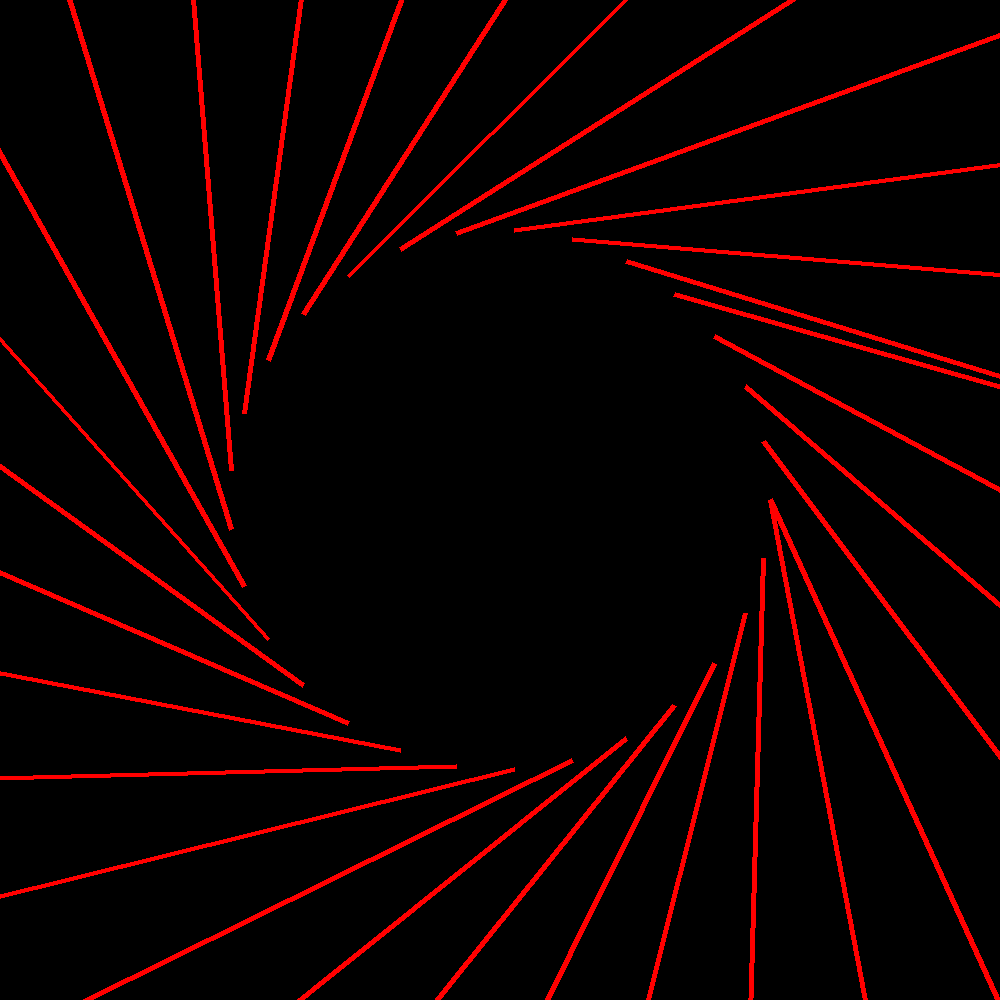

# PythonArt v1.0 (by CrudeText)

This project is a command-line art generator designed to produce static, abstract digital images using various algorithmic techniques.

All artworks are generated through mathematical or random processes, and the user interacts through a simple terminal-based interface.

---

## How to Use

### 1. Requirements

Install Python 3 and make sure you have the required libraries:

```bash
pip install matplotlib numpy pillow
```

### 2. Run the Main Script

```bash
python run_art.py
```

This will launch an interactive prompt where you'll:

- Choose a generation function (e.g., `maxlines`, `gradientImg`, etc.)
- Choose how many times to run it
- Enter parameters with help text and value hints
- See your art displayed
- (Optionally) Save the output image

---

## Available Art Functions

### 1. `maxlines(points)`
Creates a mandala-like figure using point-to-point connections around a polygon.

- **points** (int): Number of summits (vertices). Recommended 50–300.

---

### 2. `gradientImg(imgsizex, imgsizey)`
Creates a smooth gradient image from black to yellow.

- **imgsizex** (int): Width of the image
- **imgsizey** (int): Height of the image

---

### 3. `randGradient(...)`
Generates vertical columns of evolving colors, either randomly or from a base RGB.

**Key parameters:**

- `sizex`, `sizey`: Image size
- `columnsize`: Width of each color column
- `increment`: Color variation per pixel
- `darkvariation`, `lightvariation`: Probabilities of brightness/darkness
- `R`, `G`, `B`: Starting color (0–255)
- `randstart`: Whether to start with a random color
- `randvariation`: Adds randomness to how color changes over time
- `save`: Whether to save the image
- `customname`: Filename if saving

---

### 4. `SunRay(...)`
Draws symmetrical rays between two concentric rings of points to create a mandala-like radial pattern.

**Key parameters:**

- `linenumber`: Number of rays to draw
- `ringnumber`: Number of concentric ring layers
- `imgsize`: Size of the output image in pixels
- `shift`: Rotation offset between inner and outer rings
- `R`, `G`, `B`: Line color (RGB)
- `linethickness`: Width of each line
- `inRatio`, `outRatio`: Control the radii of the inner and outer rings

---

### 5. `randSun(...)`
Like `SunRay` but adds randomness to angle offsets and line colors, producing a chaotic burst of rays.

**Key parameters:**

- `linenumber`: Number of rays to draw
- `imgsize`: Image size in pixels
- `shift`: Base offset between rings
- `R`, `G`, `B`: Base colors (used less in this version)
- `linethickness`: Width of each line
- `inRatio`, `outRatio`: Ring size ratios
- `maxvarout`, `maxvarin`: Maximum angular random offsets for each ray

---

## Output Directory

All saved images are automatically placed in an `output/` folder located next to your scripts.

All configuration logs (inputs, parameters, function names) are saved to:

```text
run_logs.json
```

This file grows with each run and can be used to replicate settings or for debugging.

---

## Preview

Here are example outputs for each art function:

### `maxlines(points)`


### `gradientImg(imgsizex, imgsizey)`


### `randGradient(...)`


### `SunRay(...)`


### `randSun(...)`


## Example Usage

```bash
python run_art.py
```

```text
Available art functions:
1. maxlines: Creates a complex mandala-like figure from point-to-point connections on a polygon.
2. gradientImg: Generates a smooth linear gradient from black to yellow.
3. randGradient: Generates color columns with evolving RGB values down the image.
4. SunRay: Draws symmetrical rays between concentric circles.
5. randSun: Chaotic burst of randomized rays with color variation.
```

---

## Adding New Art Functions

1. Define a new function in `Art.py`
2. Add it to `ART_SCRIPTS` in `run_art.py` with:
   - Description
   - Parameter names and types
   - Optional: default values, min/max, choices
3. That’s it! Your new function will appear in the prompt.

---

## Project Structure

```text
.
├── Art.py               # Art generation functions
├── run_art.py           # Main interactive runner
├── output/              # Auto-created for saved images
├── run_logs.json        # Auto-created config history
└── README.md            # This file
```

---

## Author

Created by William Arranz (aka **CrudeText**)
